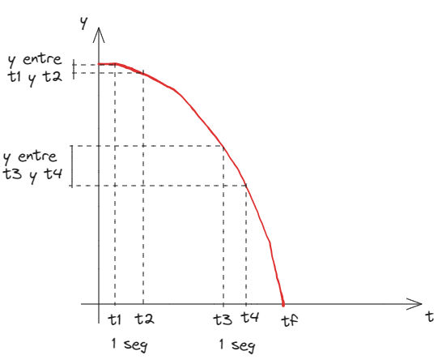
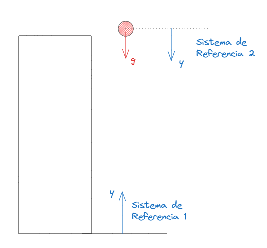
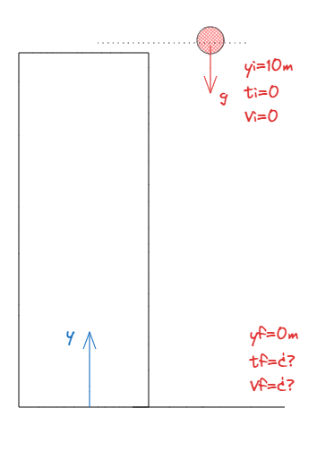
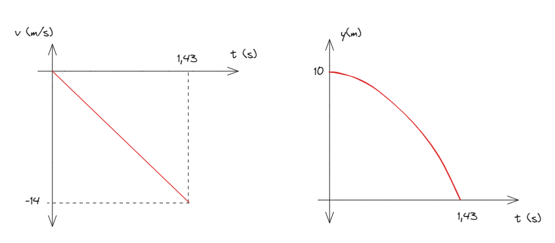

# 2.3 Caída Libre y Tiro Vertical

Cantidad medible de un sistema físico a la que se pueden asignar valores. Por ejemplo, *longitud*, *temperatura*, *fuerza*, *velocidad*.


## Introducción

Si dejamos caer una pelota desde un edificio, observaremos que cae. ¿Qué es lo que causa este movimiento? Como descubrió el gran Sir Isaac Newton, este movimiento es causado por la **atracción gravitatoria** entre la pelota y la Tierra.
Si medimos el tiempo y la posición en toda la caída, vemos que a medida que va cayendo, cada vez recorre más distancia. Dicho de otra forma, la pelota *acelera* mientras cae. Si graficamos y(t), observaremos el siguiente gráfico:

Fíjense que en el intervalo  de un segundo entre t_1y t_2la pelota cae poca altura, mientras que en el intervalo entre t_3y t_4(también de un segundo) el cuerpo recorre mucha más distancia. Esto nos comprueba que está acelerando.

Si calculamos esta aceleración veremos que obtenemos el siguiente valor:
a = -9,81 m/s^2 = g
Esta aceleración se llama **aceleración de la gravedad**.


**Aceleración de la gravedad**  
Aceleración que se produce sobre un cuerpo producto de su atracción gravitatoria con la Tierra.


Frenemos y pensemos. Estamos ante un movimiento, que puede tener una altura inicial, puede tener una velocidad inicial, su velocidad va cambiando a lo largo del movimiento, y tiene una **aceleración constante**. ¿No les suena familiar? 


La caída libre y el tiro vertical son simplemente ejemplos de un **MRUV** donde el **movimiento es vertical** y la aceleración es la **aceleración de la gravedad**.


## ¿Qué signo tiene la aceleración de la gravedad?

La fuerza gravitatoria de la Tierra atrae a los cuerpos hacia el centro de la Tierra. Por eso, la aceleración de la gravedad es siempre **hacia el centro de la Tierra**. 

¿Y eso que significa? ¿Es positiva o negativa? *Depende*. Depende de cómo plantee el sistema de referencia.

Veamos el siguiente ejemplo. En ambos casos dejo caer una pelota desde una torre. En un caso planteo mi sistema de referencia en el piso con los valores de y positivas hacia arriba (*alejándose* del centro de la Tierra) y en el otro caso lo coloco en el lugar de donde suelto la pelota.

Tome como tome el sistema de referencia, la pelota *va a caer hacia el suelo*. Esto es la realidad física, independientemente desde donde yo mire el problema. Pero en el sistema de referencia 1, la aceleración de la gravedad gva a tener un valor **negativo**, ya que el vector apunta en sentido contrario al eje y. En el sistema de referencia 2, en cambio, gapunta en el sentido positivo del eje y, por tanto es **positiva**.


**Signo de la aceleración de la gravedad**  
La aceleración de la gravedad **siempre** va hacia el centro de la Tierra. Si apunta en el mismo sentido de mi eje de referencia, la aceleración de la gravedad será **positiva**, y si apuntan en sentido opuesto será **negativa**.


## Diferencias entre Tiro Vertical y Caída Libre

Vine mencionando los términos "caída libre" y "tiro vertical" varias veces en el texto. Y varios se podrán preguntar cuales son las diferencias entre ambos.

+ El término "caída libre" se usa para hablar de un movimiento con velocidad inicial nula, donde un cuerpo se deja caer y sólo se ve afectado por la aceleración de la gravedad.
+ El término "tiro vertical" se suele referir a movimientos donde se le da una velocidad inicial al objeto, sea hacia arriba (saque de tenis, por ejemplo) o hacia abajo (arrojar un huevo desde un balcón a un peatón).

Si bien a veces son útiles, no pierdan de vista que los dos hacen referencia a un MRUV que se ve afectado por la aceleración de la gravedad. Al igual que vimos en el MRUV horizontal, puede variar el sistema de referencias y las condiciones iniciales (posición, tiempo y velocidad iniciales).

## ¿Y las fórmulas?

Las fórmulas son las mismas que para cualquier MRUV. Ya las saben. Lo único que suele cambiar es:
+ Tratar a la posición con la letra yen vez de xpara resaltar que es un movimiento vertical.
+ La aceleración vale |g|=9,81 m/s^2, positivo o negativo dependiendo del sentido de mi sistema de referencias.


**Fórmulas Caída Libre y Tiro Vertical**  
<!--  y(t)=y_i+V_i.\left(t-t_i \right) +\frac{g. \left( t-t_i \right)}{2}  -->
 y(t)=y_i+V_i.\left(t-t_i \right) \newline
V(t)=V_i+g.\left(t-t_i\right) \newline
Vf^2=V_i^2 + 2.g.\left(y_f-y_i\right) 
**Nota**: *En todas el signo de g dependerá del sentido del sistema de referencia.*


## Ejemplo 1: Caída libre

Dejamos caer (V_i=0) una piedra desde un edificio de 3 pisos (10 metros). 
1. ¿Con qué velocidad llega al piso?
2. ¿Cuánto tiempo tarda en llegar al piso?
3. Trazar los gráficos de v(t)y y(t).

Sabemos que la fórmula que vincula dos velocidades y dos posiciones es:

Vf^2=Vi^2+2a\left(y_f-y_i\right)

Reemplazamos con nuestros valores. Fíjense si entienden por qué coloqué la aceleración de la gravedad con signo negativo:

Vf^2=\left(0m/s\right)^2+2.(-g)\left(0m-10m\right)
Vf^2=2.(-9,81m/s^2)\left(-10m\right)=196,2m^2/s^2
Vf=\sqrt{196,2 m^2/s^2}\implies Vf=-14m/s

La pelota llegará al piso con una velocidad de 14 m/s. ¿Por qué negativa? La raíz cuadrada nos da dos resultados, 14 m/s y -14 m/s. El resultado correcto se deduce mirando el sistema de referencia.

Para calcular el tiempo que tardará, utilizamos la expresión de V(t):

V(t)=V_i-g.\left(t-t_i\right)

*(De vuelta, g es negativa por cómo coloqué el sistema de referencias)*

-14 \frac{m}{s}=-9,81\frac{m}{s^2}.t \implies t=\frac{-14\frac{m}{s}}{-9,81\frac{m}{s^2}} \implies t=1,43s

La pelota llegará al piso a los 1,43 segundos desde que la soltamos.

Finalmente, trazamos los gráficos solicitados:

